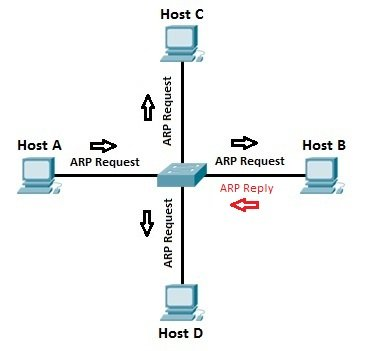

### **ARP protocol**
## 1. Khái niệm giao thức ARP là gì?
- Giao thức **ARP** (Address resolution protocol) là giao thức truyền thông được sử dụng để chuyển địa chỉ từ lớp mạng L3 sang lớp mạng L2. ARP được sử dụng để từ môt địa chỉ IP tìm ra một địa chỉ MAC.
## 2. Nguyên tắc hoạt động
- Trong mạng Ethernet và WLAN các gói IP không được gửi trực tiếp mà phải bỏ vào một khung(frame) Ethernet rồi mới được gửi đi. Các địa chỉ này là địa chỉ MAC của card mạng, một card mạng sẽ nhận được các frame có địa chỉ đích là địa chỉ MAC của card mạng đó.

    
  
- Lấy ví dụ ở hình bên trên, có 4 host được kết nối với nhau trong một mạng LAN qua một **switch**. Host A muốn gửi một bản tin tới Host B, giả sử Host A có địa chỉ IP là **192.168.1.1** còn Host B có địa chỉ IP là **192.168.1.2**. Để gửi bản tin đến Host B thì A cần phải biết được địa chỉ MAC của B. Đầu tiên A sẽ tìm trong bảng ARP lưu trữ để tìm kiếm địa chỉ IP của B cho bất kỳ ghi nhận nào hiện có của địa chỉ MAC của B. Nếu tìm thấy địa chỉ IP của B thì A sẽ gửi một frame đến B với địa chỉ đích là địa chỉ MAC của B chứa gói tin IP. Nếu không tìm thấy, thì A sẽ phải gửi một ARP request với địa chỉ MAC đích là **FFFF.FFFF.FFFF** tới tất cả các host có trong mạng LAN (broadcast).Những host nào có địa chỉ IP là **192.168.1.2** sẽ trả lời lại A bằng một bản tin ARP reply với địa chỉ IP và địa chỉ MAC của nó(ở đây là Host B như ta đã đề cập ở trên). Sau đó cả B và A sẽ ghi lại địa chỉ MAC gắn với IP của nhau để có thể sự dụng lại trong tương lai mà không cần phải broadcast nữa.
- Một bản tin ARP request và reply về cơ bản sẽ gồm 4 phần đó chính là địa chỉ IP và địa chỉ MAC của đích(destination) và nguồn(source).
- **Lưu ý:** ARP request = board cast, ARP reply = unicast.
  
