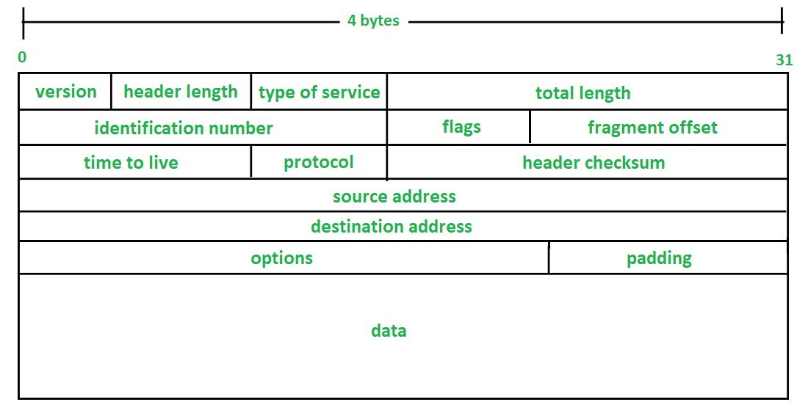

# IPv4 Header

- Đây là cấu trúc của một IPv4 header.

Sau đây chúng ta sẽ đi tìm hiểu từng field trong một Ipv4 header. 

## **Version (4 bits)**
- Có tác dụng chỉ ra phiên bản Ip sử dụng. 
- Vd : Ipv4(0100) , Ipv6(0110).
## **IHL (Internet Header Length)**
- Có chiều dài 4 bits.
- Chỉ ra độ dài của header 
- Xác định độ dài của header bằng cách lấy giá tri của trường này nhân với 4.
## **DSCP( Differentiated Services Code Point)**
- Có chiều dài 6 bits.
- Dùng cho QoS(Quality of Services).
- Dùng cho sự ưu tiên các dữ liệu nhạy cảm nếu bị delay(delay-sensitive data : streaming voice, video).
## **ECN(Explicit Congestion Notification)**
- Có chiều dài 2 bits.
- Cung cấp thông báo giữa 2 end-hosts sự tắc nghẽn mạng mà không drop packet.
- **Optionals**, bởi vì giữa các endpoints cũng có infrastructure network để hỗ trợ việc đó.
## **Total length(16 bits)**
- Chỉ là tổng độ dài của một packer(bao gồm cả l3 và l4 header).
- Nếu một packet được phân đoạn vì quá lớn. Trường này sẽ dùng để xác định phân đoạn đó thuộc packet nào.
- Tất cả các phân đoạn cùng một packet sẽ có cùng một Ipv4 header với giá trị như nhau ở trường này.
- Những pakcet được phân đoạn nếu lớn hơn MTU (Maximum Transmission Protocol Unit). (MTU: 1500 bytes)
- Tất các các các phân đoạn sẽ được lắp ráp lại thành packet nguyên bản ở bên receive host.
## **Flag Fields (3 bits)**
- Dùng để điểu khiển hoặc nhận dạng các phân đoạn
- Bit 0: luôn luôn được set về 0.
- Bit 1: Hay còn được gọi là Don't Fragment bit (DF bit), dùng để chỉ ra một packet có nên được fragmented hay ko.
- Bit 2: Hay còn được gọi là More Fragment bit (MF bit), khi set về 1 nếu còn nhiều phân đoạn nữa, set về 0 nếu không còn phân đoạn nào.
## **Fragment offset (13 bits)**
- Chỉ ra vị trí của các phân đoạn trong packet ban đầu.
- Cho phép các phân đoạn được lắp ráp lại nếu mà các phân đoạn đến bên nhận mà không đúng trình tự.
## **Time To Live (8 bits)** 
- Một router sẽ drop gói tin nếu vượt quá TTL.
- Ngăn chặn Infinite loop.
- Chỉ ra packet's maximum lifetime.
- Mỗi lần khi packet đến router , router sẽ trừ đi TTL 1 
- Recommended Default TTL là 64.
## **Protocol (8 bits)**
- Chỉ ra protocol được đóng gói trong lớp 4 PDU.
- TCP:6, UDP:17, OSPF:89, ICMP:1.
## **Header Checksum (16 bits)** 
- Dùng để kiểm tra lỗi (chỉ trên Ipv4 header).
## **Optinal**
- Hiếm khi được dùng.
- Nếu IHL field lớn hơn 5, thì nó có nghĩa là options này sẽ được sử dụng.