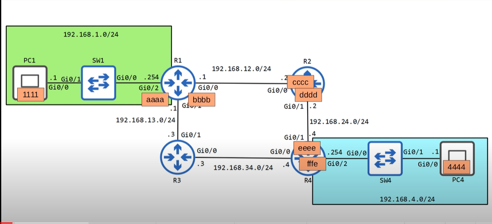
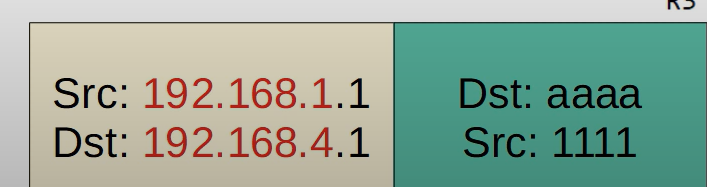

# Life cycle of packet:

### Cho một network topology như ở dưới, ở đây chúng ta sẽ xem một vòng đời của một bản tin khi được gửi từ 2 network khác nhau như thế nào ?

- Ở đây ta sẽ xét xem bản tin được gửi từ PC1(**192.168.1.1**) đến PC4(**192.168.4.1**) ra sao. 
- PC1 nhận thấy IP của PC4 ở trong một mạng khác với nó vì thế nó cần phải gửi bản tin đến `default gateway` của nó hay còn gọi là R1. Do đó để gửi bản tin đến R1, PC1 dùng ARP protocol để tìm được địa chỉ MAC của R1. PC1 gửi bản tin ARP request đến tất cả các host trong cùng một network với nó với địa chỉ nguồn chính là địa chỉ của PC1 còn địa chỉ đích chính là giao điện **Gi0/2** của R1 có địa chỉ IP là **192.168.1.254** (được cấu hình là default gateway của PC1). Vì ở đây PC1 không hề biết địa chỉ MAC của R1 nên nó sẽ gửi frame đến tất cả các host trong mạng. SW1 sẽ nhận và broadcast bản tin qua tất các các interface của SW1 trừ interface mà nó đã được nhận bản tin. Khi bản tin đến R1, R1 nhận thấy địa chỉ IP đích chính là địa chỉ IP của chính nó và gửi lại một bản tin ARP reply lại cho PC1 với địa chỉ IP và MAC đích của PC1 và địa chỉ IP và MAC nguồn của R1.
  
- Sau khi nhận được bản tin ARP reply của R1, PC1 đóng gói bản tin với Ethernet header là địa chỉ MAC của nó và địa chỉ MAC của R1. 
  
  
- R1 nhận được bản tin và remove Ethernet header. Sau đó nó thực hiện tìm kiếm trong Routing table để tìm điểm đến tiếp theo cho **192.168.4.0/24** đó chính là **192.168.168.12.2**. Do đó R1 sẽ đóng gói bản tin với một Ethernet header chứa địa chỉ MAC thích hợp cho **192.168.12.2**.Để tìm được địa chỉ MAC, R1 sử dụng giao thức ARP tương tự như PC1 ở trên.
- R2 nhận được frame từ R1 lại tiếp tục remove Ethernet header và thực hiện công việc tương tự như R1 để tìm được đường đi tiếp theo cho bản tin. Sau khi biết được địa chỉ MAC của R4 thông qua giao thức ARP. R2 lại tiếp tục đóng gói bản tin với Ethernet header và gửi cho R4.
- R4 nhận được frame và tiếp tục remove Ethernet header và tra trong routing table của nó và nhận thấy rằng lớp mạng **192.168.4.0/24** được kết nối trực tiếp qua giao diện `Gi0/2` của nó và lại một lần nữa sử dụng tiếp giao thức ARP để tìm được địa chỉ MAC của PC4. Sau khi biết được địa chỉ MAC của PC4 thì R4 gửi frame đến PC4 và cuối cùng bản tin đã đến được đích. Lưu ý rằng bản tin gốc vẫn giữ nguyên với địa chỉ nguồn và đích lần lượt của PC1 và PC4.
- Để gửi lại một bản tin từ PC4 đến PC1 thì cũng thực hiện công việc tương tự như ở trên. Tuy nhiên do đã biết được địa chỉ MAC và lưu trong bảng cấu hình nên bảng tin sẽ lần lượt đi từ PC4 đến R4, R2, R1 rồi đến PC1 mà không cần phải thực hiện gửi bất cứ môt bản tin ARP nào.
  