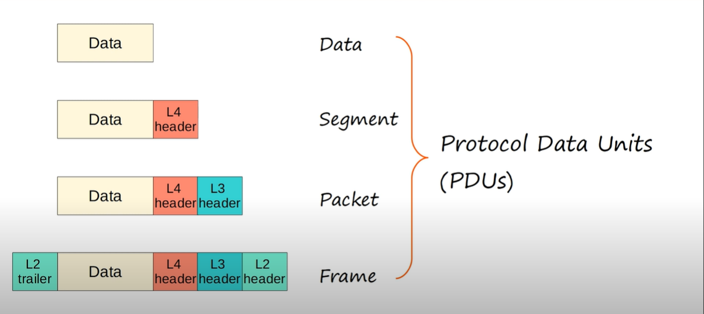

# Mô hình OSI và TCP/IP

## Mô hình OSI 7 lớp:

- Mô hình OSI mô tả 7 tầng mà hệ thống máy tính sử dụng để giao tiếp thông qua mạng. Là cơ sở chung để các máy tính có thể kết nối, giao tiếp với nhau.
- Bây giờ chúng ta sẽ đi qua từng tầng một trong mô hình OSI.
### **1.Application layer:**
- Đầu tiên là tầng ứng dụng (Application layer). Tầng ứng dụng nhìn chung là có những đặc điểm như sau:

   * Đây là tầng gần với end-user nhất.
   * Thực hiện nhiệm vụ tương tác với các software applications. VD: Web browser(Google Chrome, Edge, ...). 
   * Hai giao thức quen thuộc là HTTP và HTTPs là giao thức tại tầng này.
- Chức năng của tầng Application:
  
  * Xác định đối tượng để giao tiếp.
  * Đồng bộ giao tiếp.

### **2.Presentation Layer:** 
- Dữ liệu trong tầng này có định dạng "Application".
- Để truyền dữ liệu thông qua mạng internet, ta cần phải "translate" từ các định dạng khác nhau. Do đó nhiệm vụ của tầng này là dịch giữa application format và network format.
- VD: Mã hóa dữ liệu khi nó được gửi và giải mã dữ liệu khi được nhận.
### **3.Session Layer:**
- Điều khiển các phiên trong quá trình giao tiếp giữa các hosts.
- Khởi tạo, quản lý, hủy các kết nối giữa các local apps và remote app
### **4.Transport Layer:** 
- Phân đoạn và lắp ráp các dữ liệu cho việc giao tiếp giữa các end hosts.
- Phân đoạn một đoạn dữ liệu lớn thành các đoạn làm cho việc truyền dữ liệu được dễ dàng hơn và khả năng gây ra lỗi truyền thấp hơn nếu xảy ra.
### **3.Network Layer:**
- Cung cấp các kết giữa các end hosts ở các mạng khác nhau.
- Cung cấp Logical Addressing (IP address).
- Chọn lựa đường đi phù hợp nhất giữa host nguồn và đích.
### **2.Data link Layer:**
- Cung cấp kết nối giữa các nodes và truyền dữ liệu (VD: giữa PC và Switch hoặc giữa Switch và Router, ....).
- Định nghĩa dữ liệu được định dạng theo kiểu như thế nào để truyền tới tầng vật lý.
- Phát hiện và sửa lỗi cho các lỗi được gây ra ở tầng vật lý.
- Sử dụng L2 Addressing.
# OSI Model - PDUs (Protocol Data Units)
