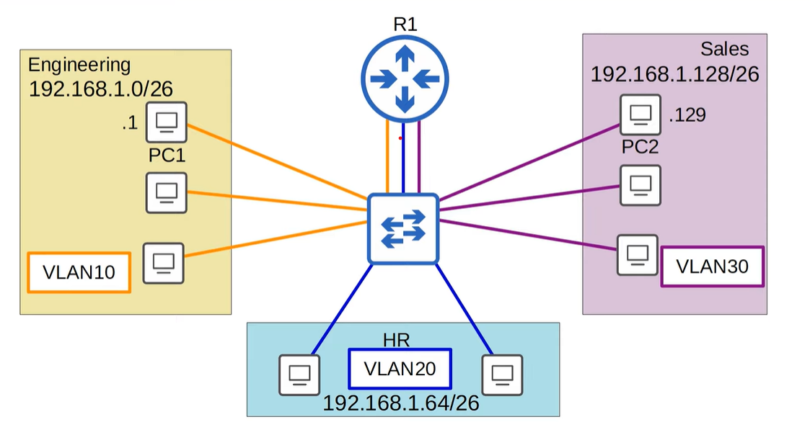

# VLANs
## LAN là gì ?
- LAN (local area network) là một nhóm là thiết bị như switches, routers, PC,... trong cùng một vị trí nhất định như là công ty hay văn phòng,...
- LAN là một `single broadcast domain` , một broadcast domain bao gồm nhiều thiết bị ở trong broadcast domain đó.
- Vậy **broadcast domain** là gì ? Boardcast domain là một nhóm các thiết bị nhận được `broadcast frame` (có địa chỉ MAC đích là: **FFFF.FFFF.FFFF**) được gửi bởi bất kỳ thiết bị nào trong boardcast domain đó.

  

- Hình ở trên mô tả 4 boardcast domain với mỗi 1 màu là một boardcast domain riêng biệt

## VLANs là gì ?

1. Mục đích của việc tạo ra VLAN ?
   - Xét một mô hình mạng trong 1 công ty dưới đây:
  
      

      Giả sử khi một PC trong khu vực engineering muốn gửi boardcast frame đến tất cả các PC khác thuộc khu vực engineering thì khi switch nhận được boardcast frame nó sẽ flood boardcast frame đến tất cả các interface của nó. Do đó mà các PC khác không thuộc khu vực engineering sẽ nhận được boardcast frame. Điều này làm tăng traffic cho mô hình mạng ảnh hướng đến performance của mạng cũng như liên quan đến các vấn đề bảo mật. Bởi lẽ, ta sẽ phải giới hạn xem ai sẽ là người có quyền được truy cập vào mỗi khu vực trong một công ty.
   - Vì vậy một giải pháp đặt ra là ta sẽ chia cho mỗi khu vực 1 subnet riêng:
  
      

      Giả sử PC1 trong engineering có địa chỉ IP là **192.168.1.1** muốn gửi 1 bản tin đến PC2 trong Sales có địa chỉ IP là **192.168.1.129**. Do biết được PC2 nằm trong subnet khác với mình nên PC1 sẽ phải gửi bản tin qua switch rồi default gateway ở R1. Khi R1 nhận được bản tin nó sẽ gửi lại cho switch rồi switch mới gửi bản tin đến PC2 ở khu vực Sales. Ở đây switch chỉ có nhiệm vụ forward gói tin.

       

      Tuy nhiên ở cách trên, vẫn xảy ra một vấn đề đó là khi PC1 gửi boardcast frame hay unknow unicast frame. Vì switch chỉ quan tâm đến L2 nên khi nhận được boardcast frame với địa chỉ MAC đích là: **FFFF.FFFF.FFFF** thì nó vẫn sẽ flood boardcast frame ra tất cả các interface của switch dẫn đến việc tất cả các PC thuộc khu vực khác đều nhận được frame. Kết quả là hạn chế như ở mô hình cũ vẫn tồn tại. Do đó VLANs ra đời để khắc phục những điểm hạn chế trên.
    
2. VLANs là gì ?
   - VLANs hay còn là Virtual Local Area Network là một giải pháp chia một mạng LAN thành các VLANs nhỏ ở L2.
 
       

   - Mỗi một khu vực sẽ được coi là 1 VLANs. Để làm được việc này ta sẽ phải cấu hình cho interface của switch nằm trong một VLAN cụ thể nào đó và end-hosts khi được kết nối với interface đó sẽ là một phần của VLAN đó. Vì switch coi mỗi VLAN là một mạng LAN riêng biệt do đó nên nó sẽ không forward traffic giữa các VLAN bao gồm cả boarcast và unknown uncast traffic. Vì vậy nên khi thực hiện gửi boardcast frame thì switch sẽ chỉ forward đến các thiết bị trong cùng 1 VLAN thôi mà không phải forward ra tất cả các interface của nó. 

## Trunk ports
 - Trong một mạng network nhỏ với vài VLANs, có thể dùng từng interface một cho từng VLANs khi kết nối switches to switches và switches to routers.
 - Tuy nhiên, khi số lượng VLANs tăng lên, cách này không còn khả thi nữa vì nó sẽ gây lãng phí interface và thông thường một router sẽ không đủ interfaces cho mỗi VLAN.
 - Trong tình huống này ta có thể dùng trunk port để carry traffic từ nhiều VLANs chỉ qua 1 interface mà thôi.
- Để nhận biết được traffic của VLANs nào, thì switches sẽ đánh dấu các frame được gửi qua trunk link. Điều này sẽ cho phép switch biết được frame thuộc VLANs nào.
## VLANs Tagging
- Có độ dài 12 bits -> có khoảng 2^12 VLANs (0-4095).
- Dùng để xác định frame này thuộc VLANs nào.
## Native VLAN
- Native VLAN được đặt mặc định là VLAN 1 trên tất cả các trunk ports, tuy nhiên có có được được cấu hình là một VLAN khác.
- Khi switch nhận được frame không có tag trên trunk port thì nó sẽ cho là frame đó thuộc về native VLAN.
  
## Router on a Stick (ROAS)
  
  - ROAS được sử dụng để route giữa nhiều VLANs sử dụng một interface duy nhất trên router và switch (`inter-VLAN routing`).
  - Router sẽ xử lý gói tin khi mà một frames với một VLAN tag đến trên subinterface đã được configured với VLAN tag đó.
## Layer 3 Switches
- là một multilayer switch thực hiện cả switch và routing.
- Có thể gán địa chỉ IP cho interfaces.
- Có thể tạo virtual interfaces cho mỗi vlan và gán IP cho những interfaces đó.
- Có thể configure route cũng nhưng sử dụng cho inter-Vlan routing như router.
