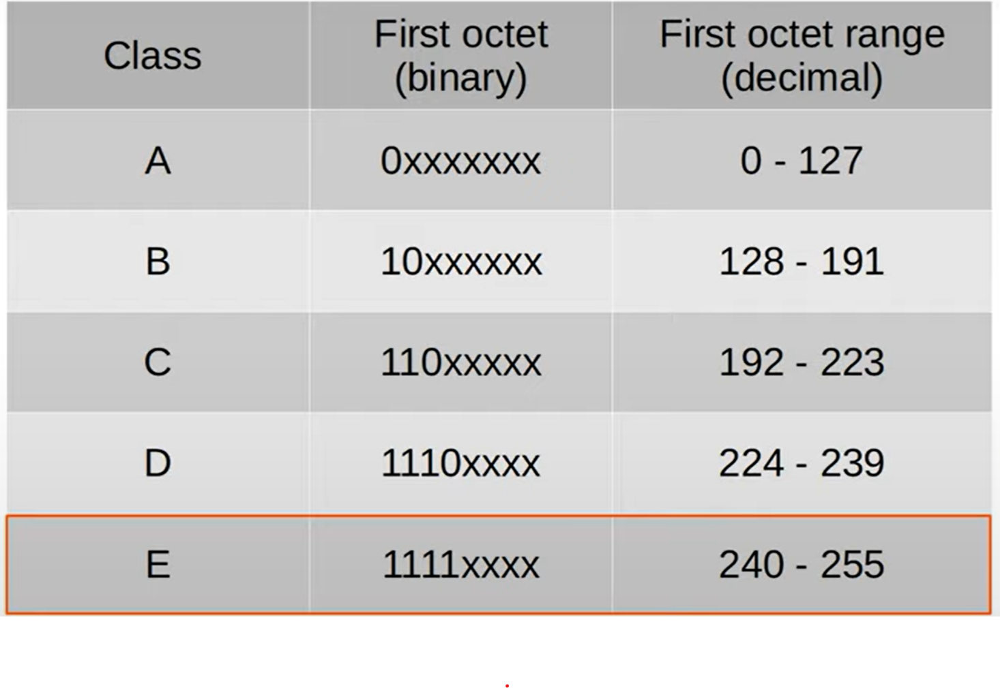
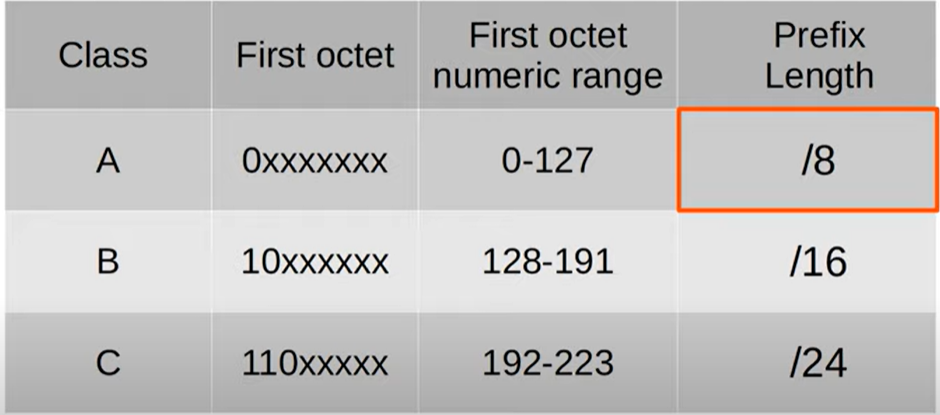
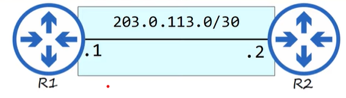

# Subnetting 
## 1. IPv4 Address Classes
- Như chúng ta đã biết IPv4 được chia thành các class A, B, C, D, E.
  
  

- Mỗi class sẽ có một dải IP riêng của nó. Ví dụ như class A sẽ có dải là **0.0.0.0** đến **127.255.255.255**, các class còn lại tương tự.
- Tuy nhiên chỉ các địa chỉ từ lớp A đến C mới có thể được gán cho một thiết bị làm địa chỉ IP vì các lớp D và E được sử dụng cho các mục đích đặc biệt khác. 
  
  

- Mỗi lớp địa chỉ đều có riêng chiều dài tiền tố riêng. Với Class A có 8 bit đầu tiên là xác định địa chỉ của lớp mạng còn lại là địa chỉ của các host trong mạng đó, tương tự với các Class còn lại. Do đó để gán địa chỉ mạng riêng biệt cho từng tổ chức một ta phụ thuộc vào quy mô của từng tổ chứ. Ví dụ với tổ chức lớn ta có thể dùng Class A hoặc Class B với số lượng địa chỉ host lớn để gán mạng còn với quy mô nhỏ hơn ta dùng Class C.
- Tuy nhiên các chia này vẫn gây ra một sự lãng phí địa chỉ IP. Do đó có một phương pháp để tránh đi sự lãng phí này đó là **CIDR**.

## 2. CIDR
- Với phương pháp này cách chia lớp mạng như trên cho từng class bị loại bỏ để cho phép một mạng lớn được chia thành các mạng con nhỏ hơn giúp tối ưu cho việc sử dụng địa chỉ IP mà không gây lãng phí. Những mạng nhỏ này được gọi là các `subnets`.
- Phương pháp CIDR cho phép chia lớp mạng theo nhiều cách khác nhau để phù hợp với từng nhu cầu sử dụng mạng.
  
  

- Ví dụ trong trường hợp trên thay vì sử dụng dải mạng **203.0.113.0/24** ta sẽ sử dụng dải mạng **203.0.113.0/30** để tối ưu được địa chỉ IP đã sử dụng do chỉ cần 2 địa chỉ IP, tránh được việc lãng phí 252 địa chỉ IP do sử dụng /24.