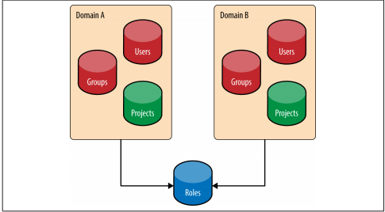

# Keystone
## Giới thiệu về Keystone:
Keystone là một service của **OpenStack** cung cấp API client authentication, khám phá các dịch vụ, cấp quyền cho multi-tenant bằng cách thực hiện OpenStack Identity's API.
### 1. Nhiệm vụ vủa Keystone:
- Xác thực người dùng và cấp quyền cũng như theo dõi quyền của họ.
- Cung cấp một đề mục các dịch vụ đang sẵn sàng với API endpoint để truy cập các dịch vụ đó.

### 2. Các services của Keystone:
Keystone được tổ chức như một nhóm các service nội bộ sẵn có trên một hoặc nhiều endpoints.
- a. Identity:
   - Identity service cung cấp những thông tin xác thực và dữ liệu về **users** và **groups**.
   - `Users` là đại diện cho một API cá nhân. Một user có thể được sở hữu bởi một **domain** đặc biệt. Trong các domain khác nhau, username có thể được trùng nhau nhưng trong cùng một domain thì username phải là duy nhất.
   - `Groups` có thể được coi như là một container chứa các users ở bên trong. Tương tự như đối với users, trong các domain khác nhau groupname có thể được trùng nhau nhưng trong cùng một domain thì group phải là duy nhất.
- b. Resource:
   - Resource service cung cấp các data về **projects** và **domains**.
   - `Projects` là đơn vị cơ bản của quyền sở hữu trong Openstack. Trong mỗi một Project sẽ có những resource của riêng nó. Một project phải được sở hữu bởi một domain.
   - `Domain` được hiểu là một container cấp cao hơn chứa projects, users và groups. Mỗi một Domain được coi như là một namespace chứa một API trong đó. 
   - Trong một Identity v3 API sẽ có các thuộc tính như sau: 
     - `Domain name`
     - `Role name`
     - `Project name`
     - `Group name`
     - `User name` 
- c. Assignment:
   - Assignment service cung cấp dữ liệu về roles và việc cấp roles.
   - `Roles` được định nghĩa như cấp bậc mà dựa vào đó end user có thể có quyền truy cấp tới. Roles có thể được gán trong cấp domain hoặc projects hoặc cũng có thể được gán cho một cấp user cá nhân và cấp groups.
   - Việc cung cấp roles có thể được định nghĩa như là một tuple gồm 3 trường là `Role`, `Resource`, `Identity`.

Mối quan hệ giữa domain, projects, user, và groups:

- d. Token:
  - Token service được sử dụng để xác nhận và quản lý các token đã sử dụng cho việc yêu cầu xác thực sau khi thông tin đăng nhập của người dùng đã được xác minh.
- e. Catalog:
  - Catalog service cung cấp một endpoint registry cho việc khám phá endpoint.
