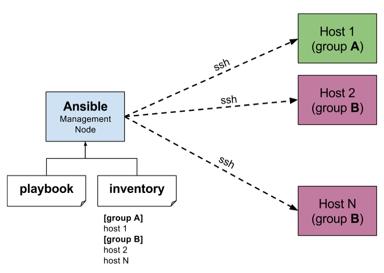
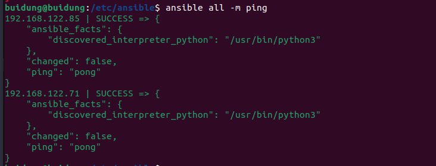

# Ansible Tutorial
## <b> Ansible </b> is an IT automation tool. It can configure systems, deploy software, and orchestrate more advanced IT tasks such as continuous deployments or zero downtime rolling updates.
## <b>Architecture of Ansible :</b>


## <b>1.Installation</b>:
Run step by step three commands below:
<!-- Code Blocks -->
``` BASH
~$ sudo apt update -y

~$ sudo apt-add-repository ppa:ansible/ansible

~$ sudo apt-add-repository ppa:ansible/ansible

```
## <b>2.Add authorized_keys to your server that you want manage</b>:
<b>Step 1: Create a key-gen </b>
<!-- Code Blocks -->
``` BASH
~$ ssh-keygen
```
<b>Step 2: Copy public key to your server</b>
<!-- Code Blocks -->
``` BASH
~$ ssh-copy-id -i id_rsa.pub your_server_name@your_server_ip
```
## <b>3. Inventory file </b>:
- The most common format of inventory file is <b>YAML</b> and <b> INI </b>. The path of inventory file is <b>/etc/ansible/hosts/</b>.
- The basic INI of inventory file looks like this: 
<!-- Code Blocks -->
``` BASH
mail.example.com
192.168.122.11
192.168.122.85
[server]
dung.edu.vn
```
- Group in ansible: you can list hosts that you can manage. Example:
<!-- Code Blocks -->
```BASH
[server]
192.168.122.13
10.0.0.1
[databaseserver]
192.168.122.77
```
However If you have a lot of hosts with a similar pattern, you can add them as a range rather than listing each hostname separately: 

<!-- Code Blocks -->
```BASH
www[01:50].example.com
```
- After configuration inventory file, we type the command below to ping to all the hosts in the inventory file (<b>type the command in the path of directory of inventory file</b>):
<!-- Code Blocks -->
```BASH
ansilbe all -m ping 
```
**Result:**

